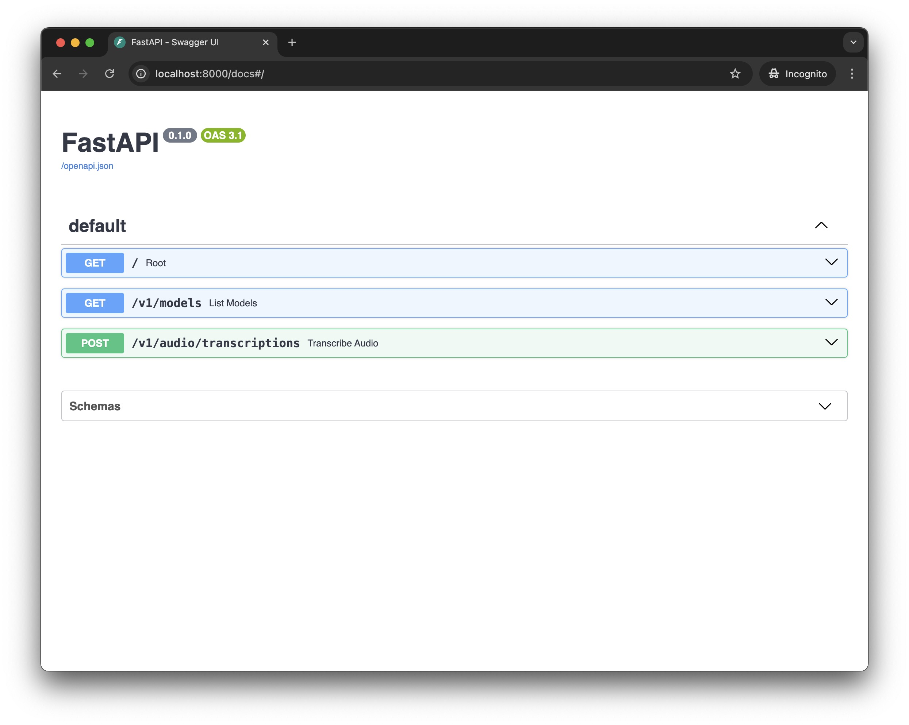
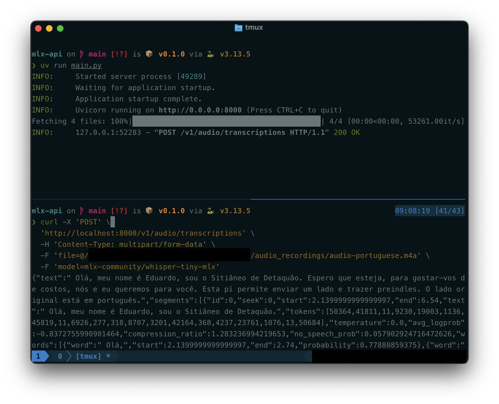
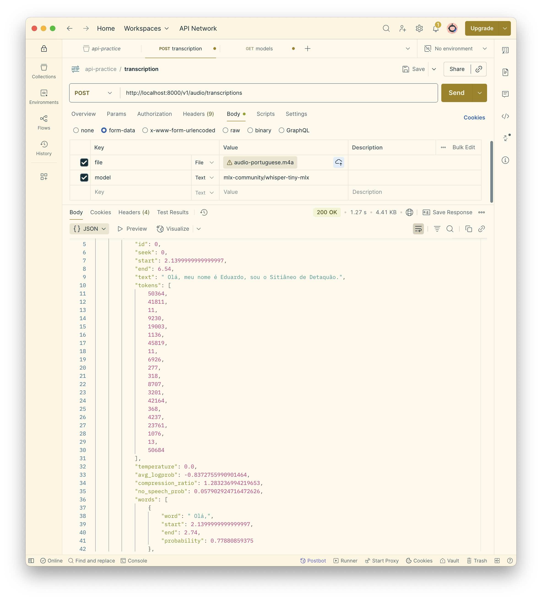
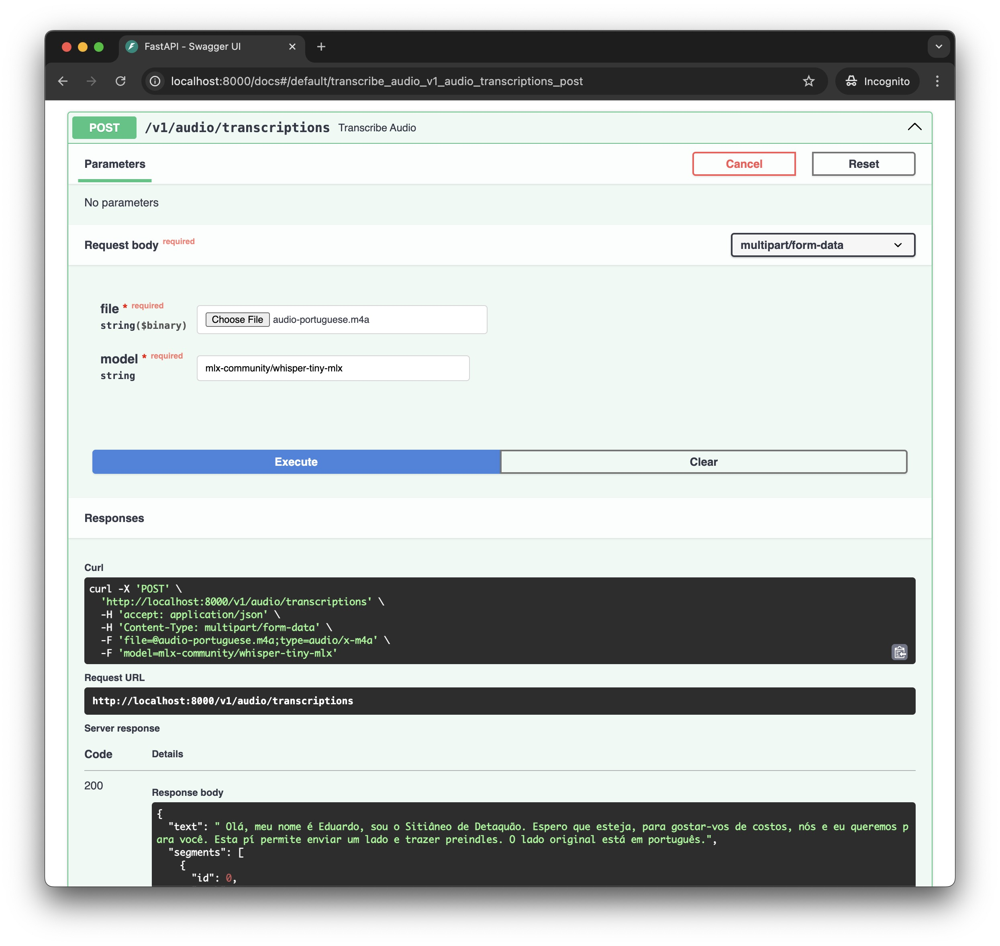

# MLX Whisper API

A fast and efficient audio transcription API that runs OpenAI's Whisper models locally using Apple's MLX framework. This API server provides OpenAI-compatible endpoints for converting speech to text, optimized for Apple Silicon Macs.

## Installation

### 1. Clone the repository

```bash
git clone https://github.com/duytechie/mlx-api.git
cd mlx-api
```

### 2. Install required dependencies

You'll need two tools: `uv` (Python package manager) and `ffmpeg` (audio processing).

Install `uv`

```bash
curl -LsSf https://astral.sh/uv/install.sh | sh
```

Install `ffmpeg`

```bash
brew install ffmpeg
```

### 3. Install Python dependencies

This command will install all the necessary Python packages listed in the project configuration.

```bash
uv sync
```


### 4. Start the local API server

```bash
uv run main.py
```

## Usage

### API Enpoints:

- `POST /v1/audio/transcriptions`: Upload audio file for transcription
- `GET /v1/models`: List all models

### Interactive Documentation

Visit `/docs` in your browser to see the interactive API documentation.



## Examples

### Using `curl`

```bash
curl -X 'POST' \
  'http://localhost:8000/v1/audio/transcriptions' \
  -H 'Content-Type: multipart/form-data' \
  -F 'file=@/path/to/your/audio.mp3' \
  -F 'model=mlx-community/whisper-tiny-mlx'
```

**Note:** Replace `/path/to/your/audio.mp3` with the actual path to your audio file.



### Using `Postman`



### Using `/docs`


